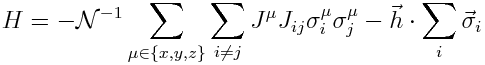
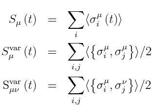

dtwa_quantum_spins
=============

Dynamics of quantum spins with homogeneous fields using the Discrete Truncated Wigner Approximation with Born-Bogoliubov-Green-Kirkwood-Yvon corrections (dTWA-BBGKY) in the dicrete Wigner phase space. There are three (3) sampling schemes used for the Monte Carlo estimate of observables, depending on the choice of phase point operators in the Wigner representation. 

Introduction
-----
The Hamiltonian that has been coded is the general Curie-Weiss - type hamiltonian



Here, the Pauli SU(2) representation is used, the Roman indices run through the lattice sites, and Greek indices run through the three spatial directions. A lattice in any dimensions and with any layout can be used, as long as the site index counting is flattened to 1d. Note that the initial condition is hard-coded to a fully x-polarized state.

The relevant terms (from left to right) are:

1. A norm that can be used to control energy divergences in the hopping terms

2. The lattice size (say, L)

3. The hopping amplitudes (3 hoppings for 3 directions embedded in the J - vector)

4. The hopping matrix (the J - matrix. Can be long range)

5. The field vector (3 components for 3 directions embedded in the h - vector)

6. The number of samples to use for the Monte Carlo averaging over the Wigner phase space (say, n_iter)

The module outputs as a python object the sampled coefficients at different times, as well as arrays containing the following observables (for all times):




The code can be used in a single processor environment, or a multiprocessor grid using [mpi4py](http://mpi4py.scipy.org/),  the Python bindings of the MPI standard.

Installation
-----
Installation involves three steps. Install git, clone this code repository, install python and all dependencies and build/install the python module(s).

1. Installing git: If git is not already installed in your system, [follow the instructions here](https://git-scm.com/book/en/v2/Getting-Started-Installing-Git). 

2. Cloning this repository: If you are on any unix-like shell environment, whether an actual unix shell (like [bash](https://www.gnu.org/software/bash/) ), a graphical terminal emulator (like [xterm](http://invisible-island.net/xterm/xterm.html), [gnome-terminal](https://help.gnome.org/users/gnome-terminal/stable/), [yakuake](https://yakuake.kde.org/) etc.) on Linux with X-Windows ([Ubuntu](http://www.ubuntu.com/), [Debian](https://www.debian.org/), [OpenSuse](https://www.opensuse.org/en/) etc.) or an environment like [Cygwin](https://www.cygwin.com/) or [MinGW](http://mingw.org/) on Microsoft Windows, just install git if necessary and run
     ```
     $ git clone https://github.com/hariseldon99/dtwa-quantum_spins
     $ echo $PWD
     ```
This causes git clone the repository to the path $PWD/dtwa_quantum_systems.     
In other cases, refer to [git setup guide](https://git-scm.com/book/en/v2/Getting-Started-First-Time-Git-Setup) and 
[git basics](https://git-scm.com/book/en/v2/Git-Basics-Getting-a-Git-Repository).

3. Install python and dependencies: If python is not already installed in your system, then refer to [these general instructions](https://wiki.python.org/moin/BeginnersGuide/Download) to download and install python and the dependencies given in the 'External dependencies' section below. Alternatively, install a python distribution like [anaconda](https://store.continuum.io/cshop/anaconda/) and use it's internal package management to install the required dependencies.

4. Build and install the python module(s)
    ```
    $ python setup.py build
    $ python setup.py install
    ```
  The first command builds the python module "dtwa_quantum_spins", as well as the optimized bbgky. The latter requires a 
  [BLAS](http://www.netlib.org/blas/) library to be installed as a [shared library](http://tldp.org/HOWTO/Program-Library-HOWTO/shared-libraries.html). If that has been done already, and is in default paths given by [ldconfig](http://tldp.org/HOWTO/Program-Library-HOWTO/shared-libraries.html) or [LD_LIBRARY_PATH](http://tldp.org/HOWTO/Program-Library-HOWTO/shared-libraries.html), the build should run correctly. Otherwise, edit the file setup.py and change the variables "blas_path" "blas_headers" to point to the path where the library and headers are installed.

  
  If you do not wish to install in root space, run the install with the --user option. Alternatively, don't run the install (just the build), start a python shell (or write a python script) and run

  ```python
  >>> import sys
  >>> sys.path.append("/path/to/build/directory/")
  >>> import dtwa_quantum_spins as dtwa
  ```

Usage
-----
Usage examples in python are shown below.

Example 1: Obtaining Documentation
```python
>>> import dtwa_quantum_spins as dtwa
>>> help(dtwa)
```

Example 2:
```python
import numpy as np
from mpi4py import MPI
import dtwa_quantum_spins as dtwa

comm = MPI.COMM_WORLD

#Your codes
#...
#You'll need to create the hopping matrix.
#If you don't, then the default is is the dense Jmn hopping matrix with inverse 
#power law decay for periodic boundary conditions.
#...

#Initiate the parameters for dTWA
p = dtwa.ParamData(hopmat=hopping_matrix,norm=scales_hopmat, latsize=lattice_size,\
	  hx=x_field, hy=y_field, hz=z_field\
	    jx=x_hopping, jy=x_hopping, jz=x_hopping)

#Initiate the DTWA system with the parameters:
#3. Set 'jac' to True if you want the integrator to use the jacobian of the BBGKY dynamics. Use
#   sparingly, since the size of the jacobian grows as lattice_size**2.

#This object sets up the truncated wigner only
d = dtwa.Dtwa_System(p, MPI_COMMUNICATOR, n_t=number_of_sampled_trajectories, verbose=True)

#This object sets up the DTWA system with BBGKY corrections and the parameters and niter
d = dtwa.Dtwa_BBGKY_System(p, comm, n_t=niter, seed_offset = 0, verbose=True)

#Prepare the times
t0 = 0.0
t1 = 1.0
nsteps = 200

#Get the output dictionary
#This contains: 
#1. The times,
#2. The single site observables (x,y and z), and 
#3. All correlation sums (xx, yy, zz, xy, xz and yz).

#You can choose different sampling schemes
data = d.evolve((t0, t1, nsteps), sampling="spr")

#Output of data
if comm.Get_rank() == 0:
      #Prepare the output files. One for each observable
      append_all = "_time_alpha_" + str(alpha) + "_N_"+str(l)+"_2ndorder.txt"
      
      outfile_magx = "sx" + append_all
      outfile_magy = "sy" + append_all
      outfile_magz = "sz" + append_all
    
      outfile_sxvar = "sxvar" + append_all
      outfile_syvar = "syvar" + append_all
      outfile_szvar = "szvar" + append_all

      outfile_sxyvar = "sxyvar" + append_all
      outfile_sxzvar = "sxzvar" + append_all
      outfile_syzvar = "syzvar" + append_all
      
      #Dump each observable to a separate file
      np.savetxt(outfile_magx, \
	    np.vstack((data.t_output, data.sx)).T, delimiter=' ')
      np.savetxt(outfile_magy, \
	    np.vstack((data.t_output, data.sy)).T, delimiter=' ')
      np.savetxt(outfile_magz, \
	    np.vstack((data.t_output, data.sz)).T, delimiter=' ')
      np.savetxt(outfile_sxvar, \
	    np.vstack((data.t_output, data.sxvar)).T, delimiter=' ')
      np.savetxt(outfile_syvar, \
	    np.vstack((data.t_output, data.syvar)).T, delimiter=' ')
      np.savetxt(outfile_szvar, \
	    np.vstack((data.t_output, data.szvar)).T, delimiter=' ')
      np.savetxt(outfile_sxyvar, \
	    np.vstack((data.t_output, data.sxyvar)).T, delimiter=' ')
      np.savetxt(outfile_sxzvar, \
	    np.vstack((data.t_output, data.sxzvar)).T, delimiter=' ')
      np.savetxt(outfile_syzvar, \
	    np.vstack((data.t_output, data.syzvar)).T, delimiter=' ')
      
      #Alternatively, convert output to discionary and dump to single 
      #file.
      #Either as a csv file
      w = csv.writer(open("output.csv", "w"))
      for key, val in vars(data).items():
	    w.writerow([key, val])
      ##Or any other way you want :)

      ##You can also use matplotlib to plot them
      import matplotlib.pyplot as plt
      plt.figure(1)
      plt.subplot(221)
      plt.plot(t_output, data.sx,label="sx")
      plt.plot(t_output, data.sy,label="sy")
      plt.plot(t_output, data.sz,label="sz")
      plt.title('Single site observables')


      plt.subplot(222)
      plt.plot(t_output, data.sxvar, label = "x-var")
      plt.plot(t_output, data.syvar, label = "y-var")
      plt.plot(t_output, data.szvar, label = "z-var")
      plt.title('Diagonal correlations')
    
      plt.subplot(223)
      plt.plot(t_output, data.sxyvar, label = "xy-var")
      plt.plot(t_output, data.sxzvar, label = "xz-var")
      plt.plot(t_output, data.syzvar, label = "yz-var")
      plt.title('Off - Diagonal Correlations')
    
      plt.show()


```


Relevant Literature:
-----

###Relevant papers:
* [PRM: arXiv:1510.03768 (2015)](http://arxiv.org/abs/1510.03768)
* [Wooters: Annals of Physics 176, 1–21 (1987)](http://dx.doi.org/10.1016/0003-4916%2887%2990176-X)
* [Anatoli : Ann. Phys 325 (2010) 1790-1852](http://arxiv.org/abs/0905.3384)
* [Mauritz: New J. Phys. 15, 083007 (2013)](http://arxiv.org/abs/1209.3697)
* [Schachenmayer: Phys. Rev. X 5 011022 (2015)](http://arxiv.org/abs/1408.4441)
* [Foss-Feig: Physical Review A 87, 042101 (2013)](https://arxiv.org/abs/1209.5795)

###Relevant docs for the bundled version of mpi4py reduce:
* [GitHub](https://github.com/mpi4py/mpi4py/blob/master/demo/reductions/reductions.py)
* [readthedocs.org](https://mpi4py.readthedocs.org/en/latest/overview.html#collective-communications)
* [Google Groups](https://groups.google.com/forum/#!msg/mpi4py/t8HZoYg8Ldc/-erl6BMKpLAJ)


###External dependencies:
1. mpi4py - MPI for Python

    _\_-MPI (Parallelizes the different samplings of the dtwa)

2. numpy - Numerical Python (Various uses)

3. scipy  - Scientific Python

    _\_-integrate 

    _| \_-odeint (Integrates the BBGKY dynamics of the sampled state)

    _| \_-signal 
    
    _| \_-fftconvolve (Used for calculating spin correlations)

4. tabulate - Tabulate module 
    
    _\_-tabulate (Used for dumping tabular data)

###TODO:
1. Add a module for decoherence dynamics with Raman and Rayleigh dissipation using Lindblad superoperators in the BBGKY heirarchy.
2. How to handle the MemoryError for large hopping matrices:
   * Write in README above docs for using np.memmap for the hopping matrix
3. Lots of work on the docs
4. Write the site-site correlations as function of time via parallel hdf5 or whatever

